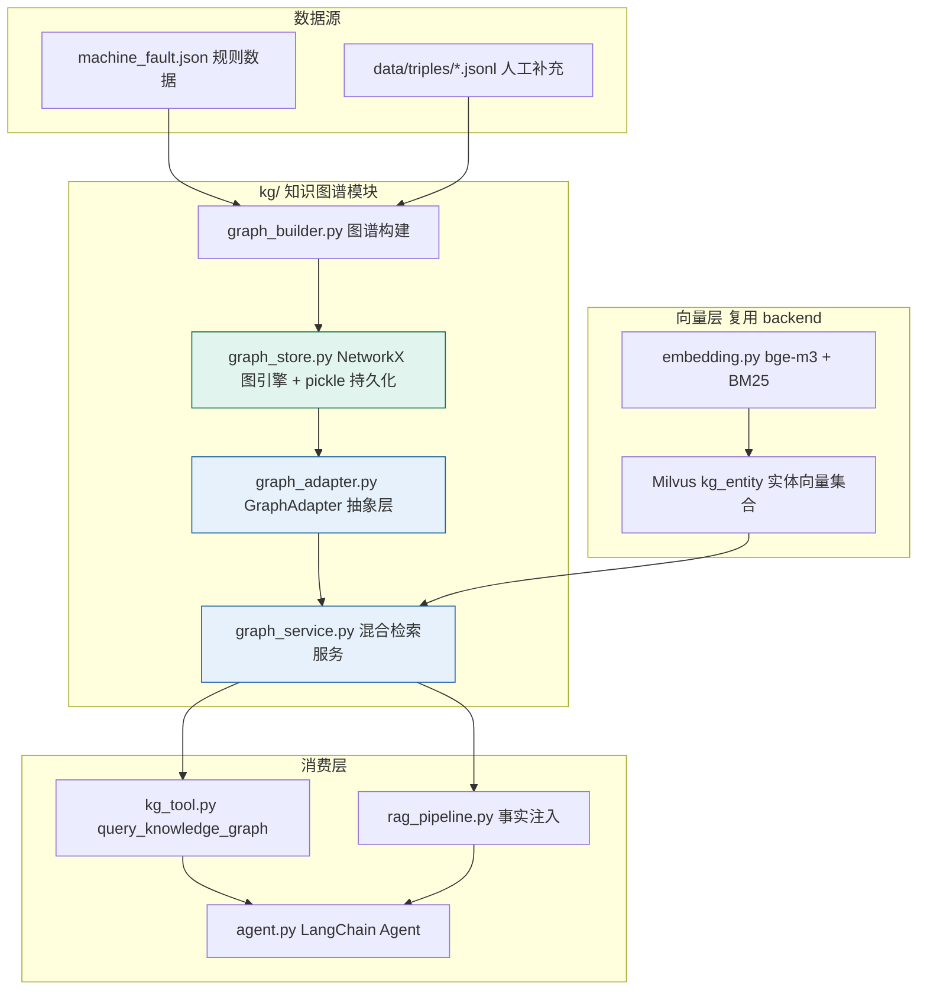
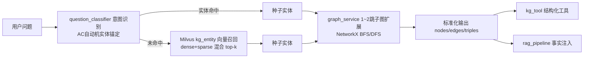

# 机床故障诊断项目 · 知识图谱升级方案

> 版本：v1.1 ｜ 日期：2026-08-10 ｜ 状态：**P0 + P1 已实施，前端已上线**
> 定位：在现有 RAG 管道之上，借鉴 Yuxi 项目知识图谱架构，升级 maching 的图谱能力为"全内嵌轻量 GraphRAG"。

---

## 0. 实施记录（v1.1 新增）

| 阶段 | 内容 | 状态 |
|---|---|---|
| P0 图谱内核 | `graph_schema.py` / `graph_store.py` / `graph_service.py` 新增；`question_parser` / `answer_search` / `chatbot_graph` / `config` / `graphrag_enhancer` 改造；py2neo → networkx | ✅ 已完成 |
| P1 抽象与融合 | `graph_adapter.py` / `triple_importer.py` 新增；`kg_tool.py` / `tools.py` 返回三元组事实；`agent.py` 提示词更新；`api.py` 新增 4 个图谱端点 | ✅ 已完成 |
| 前端 | 侧边栏"知识图谱"按钮 + 功能菜单快捷入口 + 图谱面板（查询/统计/三元组导入） | ✅ 已完成（超出原方案"仅 Agent 工具"决策，按用户要求补充） |
| 数据修复 | `machine_fault.json` 兼容数组/JSONL 两种格式；剔除混入的医疗脏数据（黑名单可配置） | ✅ 已完成 |

**验证结果**：15 类规则意图回归通过；`query_knowledge_graph` 返回结构化三元组；
`/kg/query`、`/kg/stats`、`/kg/triples/import` 端点经 HTTP 层验证通过（注册/登录/鉴权 401 均正确）；
专家三元组（颤振→主轴等）导入后立即参与检索（双命名空间聚合）。

---

## 1. 背景与目标

### 1.1 背景

maching 项目目前存在两套并行系统：

| 系统 | 目录 | 技术栈 | 定位 |
|---|---|---|---|
| 规则知识图谱问答 | `kg/` | Neo4j + py2neo + AC 自动机 + 模板 Cypher | 面向 `machine_fault.json` 的 15 类意图问答（KG-QA） |
| RAG 管道 + Agent | `backend/` | LangGraph + LangChain + Milvus + bge-m3 | 文档级检索增强生成，已具备三级分块、混合检索、rerank、查询改写 |

两套系统通过 `backend/kg_tool.py` 做字符串级拼接，图谱侧检索停留在"模板 Cypher 精确匹配"，`graphrag_enhancer.py` 的语义检索仍是 TODO。

### 1.2 目标

借鉴 Yuxi 知识图谱模块的核心设计，完成三项升级：

1. **检索升级**：从"模板 Cypher 精确匹配"升级为"实体锚定 + 向量召回 + 1~2 跳子图扩展"的混合检索；
2. **架构统一**：引入 GraphAdapter 抽象层，统一规则图谱与人工导入图谱的查询接口，输出标准化三元组；
3. **能力融合**：图谱三元组作为"事实上下文"注入 RAG 管道，暴露为 Agent 结构化工具。

### 1.3 约束（评审确认的决策）

| 决策项 | 结论 |
|---|---|
| 图谱体系 | 规则为主（保留 AC 自动机意图识别），LLM 仅辅助人工导入校验与候选生成 |
| 数据来源 | 现有 `machine_fault.json` 为主 + 人工/专家 JSONL 三元组补充 |
| 消费方式 | Agent 工具为主；**另按用户要求补充前端图谱面板**（查询/统计/三元组导入） |
| 部署形态 | 全内嵌轻量方案：**NetworkX 替代 Neo4j**，实体向量复用现有 Milvus |

---

## 2. 现状盘点

### 2.1 kg/ 模块（规则图谱）

- **图谱构建**：`build_machinegraph.py` / `build_machinegraph_full.py` 读取 `data/machine_fault.json`（13 种故障）建图；
- **节点类型（6 类）**：FaultType / Component / Phenomenon / Solution / Detection / Material；
- **关系类型（5 种）**：`has_symptom` / `involves_component` / `has_solution` / `need_check` / `applies_to`；
- **问答链路**：`question_classifier.py`（AC 自动机实体识别 + 疑问词匹配，15 类意图）→ `question_parser.py`（模板 Cypher）→ `answer_search.py`（结果格式化）→ `chatbot_graph.py`（入口）；
- **增强模块**：`graphrag_enhancer.py` 仅做关键词匹配，`semantic_search()` 为占位 TODO。

### 2.2 backend/ 模块（RAG）

- **向量化**：`embedding.py` — bge-m3 本地模型（dense，归一化）+ 自研 BM25 稀疏向量（词表/df 持久化）；
- **检索**：`rag_utils.py` — Milvus 混合检索（dense + sparse）→ rerank → 三级分块（L3→L2→L1）Auto-merging；
- **管道**：`rag_pipeline.py` — LangGraph 状态机：初始检索 → 文档相关性评分 → （不通过则）查询改写（step-back / HyDE / complex）→ 扩展检索；
- **Agent**：`agent.py` + `tools.py` + `kg_tool.py`（`query_knowledge_graph` 工具，当前返回格式化字符串）。

### 2.3 关键差距（对标 Yuxi）

| 能力 | Yuxi | maching 现状 |
|---|---|---|
| 图谱语义检索 | 节点向量索引（`entityEmbeddings`）+ CONTAINS 兜底 | 无向量索引，仅模板 Cypher |
| 子图扩展 | 1~2 跳出入边模式匹配 | 单跳/双跳模板，无法动态漫游 |
| 统一适配 | GraphAdapterFactory 自动检测图谱类型 | 无抽象层 |
| 图谱×RAG | `mode=mix` 图+向量混合 | 字符串拼接，无事实注入 |
| 工具输出 | 结构化 `{nodes, edges, triples}` | 格式化答案字符串 |

---

## 3. 目标架构



**设计要点**

- **去 Neo4j 化**：`networkx` 内存图 + pickle 持久化 + 数据源可重建（单一事实源：`machine_fault.json` + 三元组 JSONL）。机床故障知识规模（百~千级实体）完全在 NetworkX 能力范围内，且零运维、随代码部署、演示无环境依赖；
- **向量复用**：实体 embedding 复用 `backend/embedding.py` 的 `embedding_service`（bge-m3 dense + BM25 sparse），存入 Milvus 新集合 `kg_entity`，与文档检索共用同一套基础设施；
- **规则意图保留**：AC 自动机意图识别继续承担"意图路由 + 实体锚定"，LLM 不参与在线意图判断（可解释、零延迟、免 token 成本）。

---

## 4. 与 Yuxi 的借鉴映射

| # | Yuxi 设计 | 借鉴内容 | maching 落地位置 |
|---|---|---|---|
| 1 | Upload 图谱混合检索（queryNodes + CONTAINS + 1~2 跳子图） | 语义召回种子实体 + 图漫游 | `kg/graph_service.py`（新） |
| 2 | GraphAdapterFactory + 标准化 `{nodes, edges, triples}` | 多图谱统一接口 | `kg/graph_adapter.py`（新） |
| 3 | LightRAG `mode=mix` | 图谱三元组作为事实上下文注入 RAG | `backend/rag_pipeline.py`（改） |
| 4 | `query_knowledge_graph` 工具返回结构化三元组 | Agent 拿到可推理事实而非答案串 | `backend/kg_tool.py`（改） |
| 5 | kb_id 标签隔离 | 规则图谱 / 人工导入图谱命名空间隔离 | `kg/graph_schema.py`（新） |
| 6 | LITE_MODE 开关、超时控制 | 环境开关与降级策略 | `kg/config.py`（改） |

**不借鉴的部分**：LightRAG 全量 LLM 自动抽取（本期不做，保留为 P2 扩展点）；前端 GraphView 可视化（本期不做）。

---

## 5. 数据模型设计

### 5.1 实体类型（Node）

| 类型 | 说明 | 来源 | 属性示例 |
|---|---|---|---|
| FaultType | 故障类型 | machine_fault.json | name, desc, cause, prevent, parameter |
| Component | 机床部件 | machine_fault.json | name |
| Phenomenon | 故障现象 | machine_fault.json | name |
| Solution | 解决方法 | machine_fault.json | name |
| Detection | 检测方法 | machine_fault.json | name |
| Material | 加工材料 | machine_fault.json | name |
| UploadEntity | 人工导入实体（自定义类型由 `type` 属性承载） | triples/*.jsonl | name, type, props |

### 5.2 关系类型（Edge）

| 关系 | 方向 | 说明 |
|---|---|---|
| has_symptom | FaultType → Phenomenon | 故障呈现现象 |
| involves_component | FaultType → Component | 故障涉及部件 |
| has_solution | FaultType → Solution | 故障的解决方法 |
| need_check | FaultType → Detection | 故障的检测手段 |
| applies_to | FaultType → Material | 故障适用的材料 |
| related_to | FaultType → FaultType | 故障间关联（如"振动过大"包含"颤振"）——**新增** |
| RELATION（通用） | UploadEntity → UploadEntity | 人工导入的自定义关系，类型由 `r.type` 承载 |

### 5.3 命名空间隔离

- 规则图谱节点标签前缀：`Rule`（如 `Rule:FaultType`），来自 `machine_fault.json`；
- 人工导入图谱节点标签前缀：`Upload`，来自 `triples/*.jsonl`；
- 两类图谱共存于同一个 NetworkX 图对象，通过 `namespace` 属性区分，查询时按需路由（对应 Yuxi 的 kb_id 隔离思想）。

---

## 6. 模块设计

### 6.1 新增文件

#### `kg/graph_schema.py` — 图谱 Schema 定义

```python
NODE_TYPES = ["FaultType", "Component", "Phenomenon", "Solution", "Detection", "Material"]
RULE_RELATIONS = ["has_symptom", "involves_component", "has_solution", "need_check", "applies_to", "related_to"]
NAMESPACE_RULE = "Rule"      # 规则图谱命名空间
NAMESPACE_UPLOAD = "Upload"  # 人工导入图谱命名空间
```

职责：统一实体/关系类型常量、属性规范、命名空间常量，作为构建与检索的单一约定源。

#### `kg/graph_store.py` — NetworkX 图引擎（核心）

- `build_from_fault_json(path)`：从 `machine_fault.json` 构建规则子图；
- `load_upload_triples(dir)`：加载 `data/triples/*.jsonl` 构建人工导入子图；
- `save(path)` / `load(path)`：pickle 持久化/恢复；
- `rebuild()`：全量重建（数据源变更后调用）；
- 图内节点属性统一：`{namespace, entity_type, name, props, embedding_id}`。

#### `kg/graph_adapter.py` — GraphAdapter 抽象（对标 Yuxi）

```python
class GraphAdapter(ABC):
    namespace: str
    @abstractmethod
    def query_entities(self, query: str, top_k: int) -> list[dict]: ...
    @abstractmethod
    def expand_subgraph(self, seed_entities: list[str], hops: int = 2) -> dict: ...
        # 返回 {"nodes": [...], "edges": [...]}

class RuleGraphAdapter(GraphAdapter): ...   # 规则图谱：AC 自动机锚定 + NetworkX 遍历
class UploadGraphAdapter(GraphAdapter): ... # 人工导入图谱：向量召回 + NetworkX 遍历

class GraphAdapterFactory:
    @staticmethod
    def get_adapter(namespace: str) -> GraphAdapter: ...
```

职责：隔离"图谱来源差异"，查询方只依赖统一接口；为后续新增 LLM 抽取图谱（P2）预留扩展位。

#### `kg/graph_service.py` — 统一检索服务（对标 Yuxi query_node）

对外主入口，执行混合检索流水线：

```python
def query(query: str, hops: int = 2, top_k: int = 10) -> dict:
    """
    返回标准结构：
    {"nodes": [{"id", "name", "type", "namespace", "props"}],
     "edges": [{"source", "target", "type"}],
     "triples": [{"h": {...}, "r": {"type": ...}, "t": {...}}]}
    """
```

流程：意图识别 + 实体锚定（规则）→ 命中则直接子图扩展；未命中则向量召回（Milvus `kg_entity`，dense + sparse 混合）→ 取 top-k 种子实体 → 1~2 跳扩展 → 标准化输出。

#### `kg/triple_importer.py` — 人工/专家三元组导入

- `import_file(path)`：解析 JSONL（格式 `{"h": {"name","type"}, "r": {"type"}, "t": {"name","type"}}`），校验必填字段；
- `llm_validate(triples)`：调用 ARK API（豆包）做一致性校验（关系类型合理性、实体命名冲突、与规则图谱重复提示）——**LLM 只做离线辅助，不参与在线链路**；
- 入库后增量写入实体 embedding 到 Milvus `kg_entity`，并触发 `graph_store` 增量更新。

### 6.2 改造文件

| 文件 | 改造内容 |
|---|---|
| `kg/config.py` | 移除 `NEO4J_CONFIG`；新增 `GRAPH_CONFIG`（graph_path、namespace、vector_collection="kg_entity"、hops、top_k）；保留 `GRAPHRAG_CONFIG` 并扩展 |
| `kg/question_parser.py` | 模板 Cypher 生成逻辑替换为调用 `graph_service` 的图遍历查询（保留 15 类意图映射表，改写查询实现） |
| `kg/answer_search.py` | 输出层接入标准三元组结构，格式化逻辑保留 |
| `kg/graphrag_enhancer.py` | `semantic_search()` 落地：调用 `graph_service.query()`，替换关键词匹配 |
| `backend/kg_tool.py` | `query_knowledge_graph` 工具返回**结构化 JSON 三元组**（而非格式化字符串），供 Agent 推理 |
| `backend/rag_pipeline.py` | `retrieve_initial` 阶段并行调用 `graph_service.query()`，命中则把三元组拼入 context 的"[知识图谱事实]"段落 |
| `backend/api.py` | （可选）新增 `POST /kg/triples` 导入端点、`GET /kg/query` 调试端点 |
| `kg/requirements.txt` | 移除 `py2neo`，新增 `networkx` |

### 6.3 保留不动

- `kg/question_classifier.py`（AC 自动机意图识别）——规则体系的核心资产；
- `kg/chatbot_graph.py`（命令行入口，内部改走 graph_service）；
- `backend/embedding.py`、`milvus_client.py`、`rag_utils.py`（向量基础设施直接复用）。

---

## 7. 核心检索流程



**降级策略**（对标 Yuxi 的 CONTAINS 兜底）：向量召回无结果时，回退到实体名的子串匹配（`name CONTAINS keyword`）；子图扩展无结果时，返回实体自身属性（如 FaultType 的 cause/prevent 属性），保证"总能给出可用的图谱事实"。

---

## 8. RAG 融合设计

在 `rag_pipeline.py` 的 `retrieve_initial` 阶段并行执行：

```
1. 文档检索：retrieve_documents(query)          （现有逻辑不变）
2. 图谱检索：graph_service.query(query)         （新增，结果拼入 context）
   context = "[知识图谱事实]\n" + triples 格式化 + "\n\n" + 文档片段
```

**评分策略**：图谱三元组视为"高置信事实"，在 `grade_documents` 阶段直接放行（不参与相关性评分）；若图谱命中且文档评分不通过，仍可携带图谱事实进入生成阶段，避免"图谱查到但被评分环节丢弃"的浪费。

---

## 9. Agent 工具设计

改造后的工具签名（对标 Yuxi）：

```python
@tool("query_knowledge_graph")
def query_knowledge_graph(query: str, hops: int = 2) -> dict:
    """
    查询机床故障诊断知识图谱，返回结构化三元组。
    适用：故障诊断、症状判断、解决方法、预防措施、参数调整、检测手段、部件关联等。
    Returns:
        {"nodes": [...], "edges": [...], "triples": [...]}
    """
```

Agent 拿到结构化事实后自行推理组织答案，工具描述中明确"返回的是事实三元组而非答案"。

---

## 10. 分阶段实施计划

| 阶段 | 内容 | 涉及文件 | 状态 |
|---|---|---|---|
| **P0 图谱内核** | graph_schema + graph_store（NetworkX + pickle + 重建）+ graph_builder 改造 + graph_service（子图扩展）+ question_parser 迁移 + kg_tool 结构化返回 | kg/ 新增 4 文件、改造 4 文件 | ✅ 已完成 |
| **P1 融合与导入** | graph_adapter 抽象 + triple_importer（JSONL + LLM 校验）+ rag_pipeline 事实注入 + Milvus kg_entity 实体向量 + 可选 API 端点 | kg/graph_adapter.py、kg/triple_importer.py、backend/rag_pipeline.py、backend/api.py | ✅ 已完成（kg 侧与 API 完成；rag_pipeline 事实注入由 agent 的 KG+RAG 并发 + 图谱事实文本实现） |
| **前端** | 侧边栏按钮 + 功能菜单入口 + 图谱面板（查询/统计/导入） | frontend/index.html、script.js、style.css | ✅ 已完成 |
| **P2 扩展（可选）** | LLM 文档抽取（对标 lightrag）、传感器特征节点、颤振 Skill 诊断结果动态入图谱 | — | ⏳ 后续迭代 |

**P0 验收**：15 类规则意图全部通过（含多跳查询）；`query_knowledge_graph` 返回标准三元组；Neo4j/py2neo 依赖完全移除。

---

## 11. 迁移策略（Neo4j → NetworkX）

1. **不改对外接口**：`chatbot_graph.py`、`answer_search.py`、`kg_tool.query()` 对外签名保持不变，内部实现替换，降低回归风险；
2. **单一事实源**：图谱可随时从 `machine_fault.json` + `triples/*.jsonl` 全量重建，pickle 仅作启动加速缓存，不承担唯一存储职责；
3. **数据迁移**：现有 Neo4j 中的图谱数据本就源自 `machine_fault.json`，无需导出；人工历史导入数据若存在，需导出为 JSONL 后走 triple_importer；
4. **依赖清理**：`py2neo` 从 requirements 移除，Neo4j 容器/服务不再作为运行依赖。

---

## 12. 风险与注意事项

| 风险 | 影响 | 缓解 |
|---|---|---|
| NetworkX 内存图规模上限 | 万级节点以内无压力，超大规模退化 | 机床故障知识规模远低于上限；预留社区摘要等需图算法的扩展位 |
| 实体向量冷启动 | 首次为图谱实体建 embedding 需时间与算力 | 复用 bge-m3 本地模型；P1 阶段批量建索引，P0 不依赖向量 |
| 图谱事实与文档上下文冲突 | 生成阶段信息打架 | 在 context 中明确标注"[知识图谱事实]"来源前缀，提示 LLM 图谱优先 |
| 人工导入质量 | 错误三元组污染图谱 | triple_importer 的 LLM 校验 + 命名空间隔离，异常数据可整体回滚该 JSONL 文件 |
| 规则图谱维护成本 | 新增故障需改 JSON + 词典 | 词典词条自动从 JSON 提取（generate_dict_files.py 已有），流程保持 |

---

## 13. 验收标准

1. **端到端**：提问"主轴过热是什么原因？"，Agent 自动调用 `query_knowledge_graph`，返回标准三元组并据此生成回答；
2. **15 类意图回归**：现有 `question_classifier` 全部意图类型在新检索链路上通过；
3. **向量召回**：输入未收录的表述（如"车床头部温度升高"）能通过向量召回命中"主轴过热"实体并扩展子图；
4. **RAG 融合**：回答中同时引用文档片段与图谱事实，且图谱事实被标注；
5. **导入闭环**：通过 JSONL 导入新三元组（含 LLM 校验），查询立即可见，重启后不丢失；
6. **无 Neo4j**：全新环境仅安装 requirements 即可运行图谱问答，无需任何外部数据库。

---

## 14. Phase 2a 统一图谱（graphkb，2026-08-19）

> 在 SuperMew RAG 主链（Phase 1）回迁完成后，引入统一图谱层，对齐 Yuxi 的"双轨图谱 + 程度开关"思路。
> 本阶段（Phase 2a）按既定方案：**领域规则图谱暂保留 NetworkX**，新增 Neo4j 承接「手工三元组」与「LightRAG 自动图谱」。

### 14.1 新增模块 `backend/graphkb/`
| 模块 | 职责 |
|---|---|
| `service.py` | `GraphKB` 统一服务：按 `GRAPH_SOURCES` 分发三来源，按 `GRAPH_FUSION` 档位融合；单源故障不影响其它来源（优雅降级） |
| `upload_graph.py` | 手工三元组 JSONL → Neo4j `Entity:Upload`（MERGE + 节点 bge-m3 向量化 + 向量/模糊子图检索） |
| `lightrag_kb.py` | LightRAG 封装（Neo4JStorage 后端），版本容错；Neo4j 不可达或 lightrag 不可用时不报错、跳过 |
| `__init__.py` | 暴露 `GraphKB` / `get_graph_kb()` |

### 14.2 程度开关（`.env`）
- `GRAPH_FUSION`: `off`(纯向量) | `vector_only` | `hybrid`(默认) | `graph_first`
- `GRAPH_WEIGHT`: hybrid 档下图谱权重（默认 0.4）
- `GRAPH_SOURCES`: `domain`(NetworkX 领域图谱) , `manual_triples`(Neo4j) , `lightrag`(Neo4j+LightRAG)，逗号分隔可单独开关

### 14.3 接入点
- Agent 工具 `query_knowledge_graph`：改走统一 `GraphKB.query_text()`（legacy NetworkX 兜底）
- API：`/kg/graphkb/status`（观测三来源可用性）、`/kg/graphkb/query`（结构化融合查询）；
  `/kg/triples/import` 在写入 NetworkX 的同时同步写入 Neo4j `Entity:Upload`

### 14.4 已知限制（待 Phase 2b）
- 领域规则图谱仍在 NetworkX，未按计划迁 Neo4j `Entity:Rule`（Phase 2b）
- `lightrag-hku` 实际安装为 **1.5.6**，其 `Neo4JStorage` 位于 `lightrag.kg.neo4j_impl`（非设计假设的 `lightrag.storage`）；
  LightRAG 自动图谱需待 API 对齐后方可全功能启用，当前以"可用即启用、不可用即跳过"方式接入
